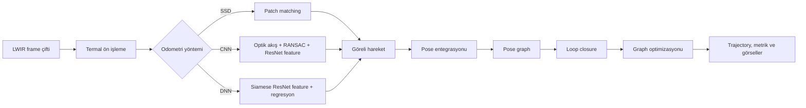
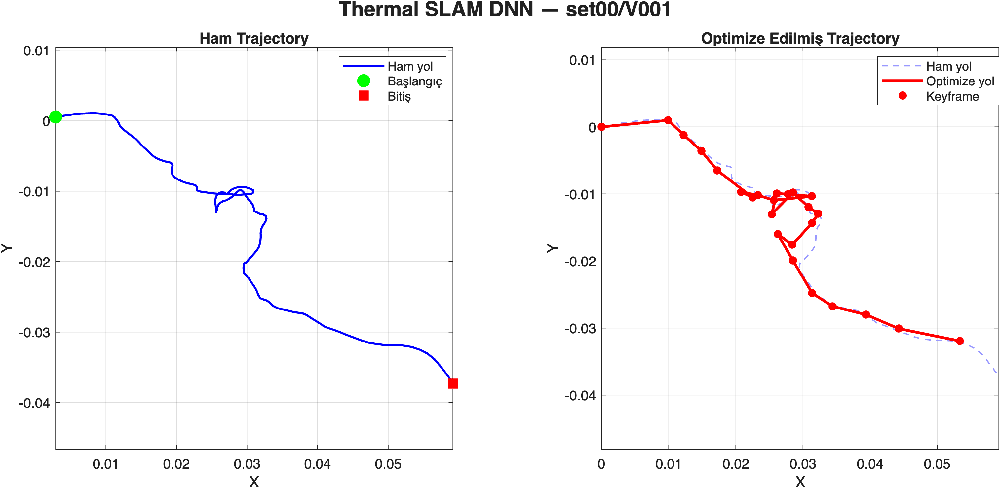
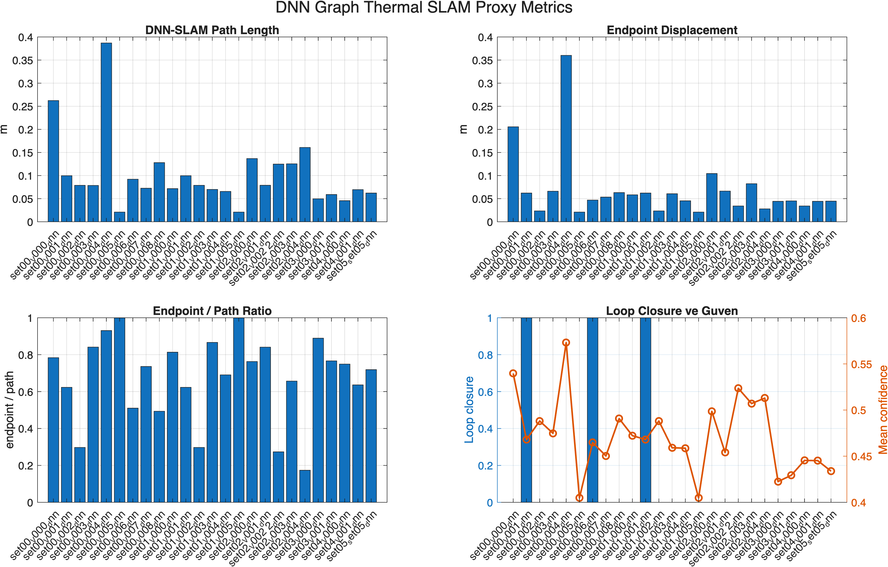
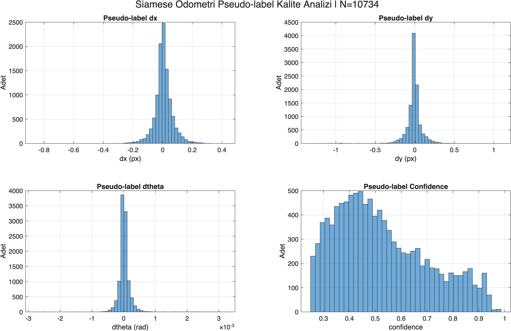
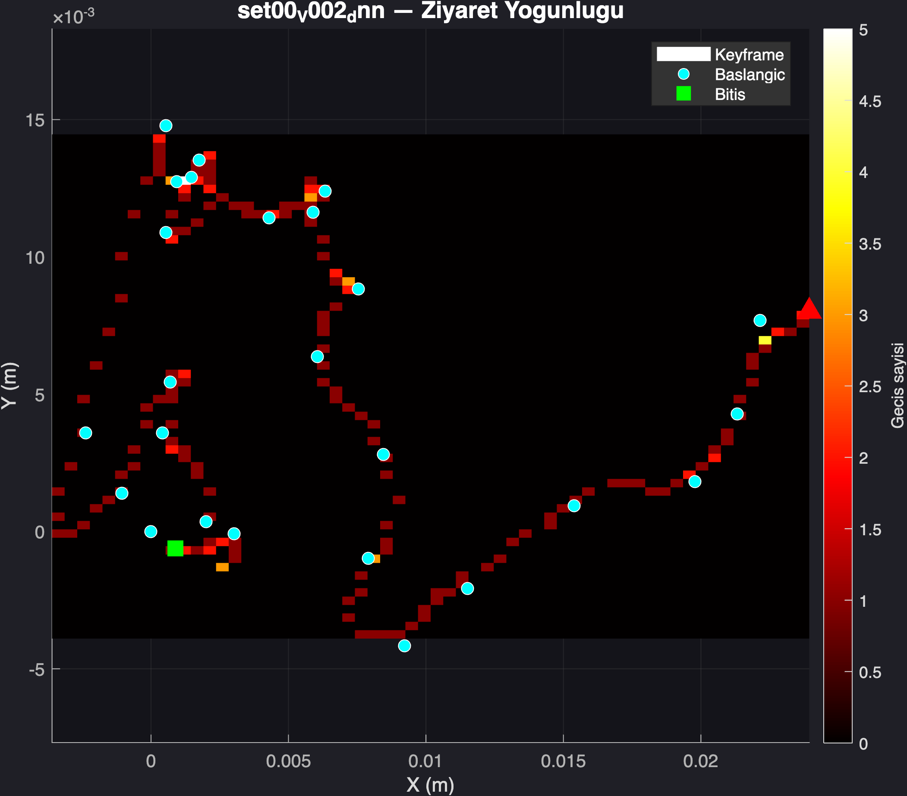
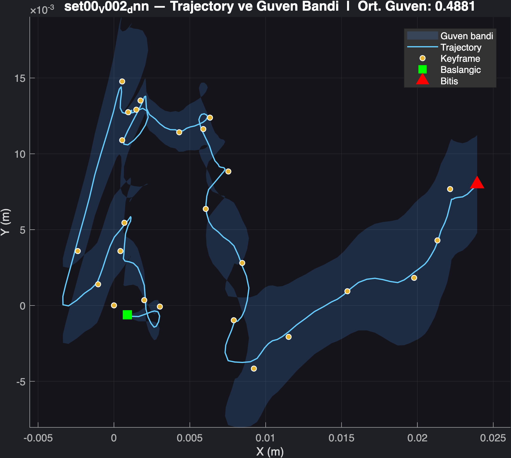
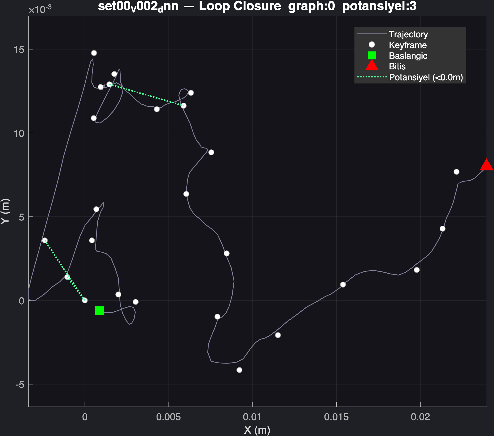

<div align="center">

# Deep Learning Based Graph Thermal SLAM

**Termal görüntüler üzerinde odometri, pose graph optimizasyonu ve loop closure analizi için MATLAB tabanlı deneysel SLAM sistemi**

[](https://www.mathworks.com/products/matlab.html)


</div>

---

## Proje Hakkında

Bu proje, **KAIST Multispectral Pedestrian Dataset** içerisindeki LWIR (Long-Wave Infrared) görüntülerden kamera hareketi ve iki boyutlu trajectory tahmini üretmek için geliştirilmiştir. Sistem; görüntü ön işleme, odometri, pose graph oluşturma, loop closure, graph optimizasyonu, metrik hesaplama ve sonuç görselleştirme adımlarını tek bir MATLAB kod tabanında birleştirir.

Projede üç farklı yaklaşım bulunmaktadır:

| Yöntem | Odometri yaklaşımı | Temel amaç |
|---|---|---|
| **SSD** | Ardışık termal frame'lerde Sum of Squared Differences ile patch eşleme | Hafif ve klasik bir baseline oluşturmak |
| **CNN + RANSAC** | Lucas-Kanade optik akış, RANSAC ve ResNet-18 feature benzerliği | Derin özelliklerle desteklenen hibrit odometri üretmek |
| **DNN Graph SLAM** | Siamese-style ResNet-18 frame-pair özellikleri ve DNN regresyonu | `dx`, `dy`, `dtheta` tahminlerini pose graph ve loop closure ile birleştirmek |

> [!IMPORTANT]
> Mevcut veri klasörlerinde gerçek kamera pose ground truth'u bulunmadığı için DNN odometri modeli, Lucas-Kanade optik akıştan üretilen **pseudo-label** değerleriyle eğitilir. Ground truth bulunmayan deneylerde raporlanan path length, endpoint ratio ve confidence değerleri **proxy metriktir**; ATE/RTE yerine geçmez.

---

## İçindekiler

- [Sistem Mimarisi](#sistem-mimarisi)
- [Yöntemler](#yöntemler)
- [Kullanılan Teknolojiler](#kullanılan-teknolojiler)
- [Veri Seti ve Klasör Yapısı](#veri-seti-ve-klasör-yapısı)
- [Kurulum](#kurulum)
- [Projeyi Çalıştırma](#projeyi-çalıştırma)
- [Değerlendirme ve Metrikler](#değerlendirme-ve-metrikler)
- [Sonuç Görselleri](#sonuç-görselleri)
- [Proje Yapısı](#proje-yapısı)
- [Üretilen Çıktılar](#üretilen-çıktılar)
- [Bilimsel Kapsam ve Sınırlılıklar](#bilimsel-kapsam-ve-sınırlılıklar)

---

## Sistem Mimarisi



Sistem akışı özetle şu adımlardan oluşur:

1. LWIR frame'leri gri seviyeye dönüştürülür ve `[0,1]` aralığına normalize edilir.
2. Kontrollü kontrast artırma, gamma düzeltme, hafif Gaussian blur ve keskinleştirme uygulanır.
3. Seçilen yönteme göre frame'ler arasındaki göreli hareket hesaplanır.
4. Hareket tahminleri poz bilgisine entegre edilir ve keyframe'ler pose graph düğümü olarak eklenir.
5. DNN hattında ResNet-18 feature benzerliğiyle loop closure adayları aranır.
6. Odometri ve loop edge'leri kullanılarak graph iteratif biçimde optimize edilir.
7. Ham/optimize trajectory, confidence, heatmap, loop closure ve metrik çıktıları kaydedilir.

---

## Yöntemler

### 1. SSD Baseline

`main_ssd.m`, seçilen bir termal patch'i sınırlı arama penceresinde kaydırır ve her konum için SSD maliyetini hesaplar. En düşük maliyetli konum frame hareketi olarak alınır. Aykırı sıçramalar sınırlandırılır, güven skoru ile ağırlıklandırılır ve low-pass filtre uygulanır.

```text
LWIR frame -> preprocessing -> SSD patch search -> confidence weighting
           -> motion smoothing -> pose graph -> graph optimization
```

### 2. CNN + RANSAC Odometri

`main_cnn.m`, ResNet-18'in `pool5` katmanından 512 boyutlu L2-normalize feature çıkarır. Hareket doğrudan CNN tarafından regresyonla üretilmez; Lucas-Kanade optik akış RANSAC ile filtrelenir, ResNet feature benzerliği ise güven hesabına yardımcı olur.

```text
LWIR frame -> ResNet-18 feature
           -> Lucas-Kanade optical flow
           -> RANSAC median motion
           -> CNN/RANSAC confidence fusion
           -> pose graph -> graph optimization
```

### 3. DNN Graph Thermal SLAM

DNN hattı, ortak ResNet-18 feature extractor kullanan Siamese-style bir frame-pair gösterimi oluşturur:

```text
[feat1, feat2, feat2-feat1, abs(feat2-feat1)] -> 2048-D pair feature
```

Bu vektör, `512 -> 128 -> 3` tam bağlantılı regresyon ağına verilerek göreli `dx`, `dy` ve `dtheta` tahmini üretilir. Tahminler kalibre edilir, yumuşatılır ve pose graph'a odometry edge olarak eklenir.

DNN hattındaki loop closure aşaması:

- zamansal olarak yakın keyframe'leri arama dışında bırakır,
- cosine similarity eşiğini uygular,
- en iyi ve ikinci en iyi eşleşme arasında minimum margin arar,
- kabul edilen eşleşmeyi ağırlıklı loop edge olarak graph'a ekler,
- yanlış pozitiflerin etkisini azaltmak için loop edge'lerini daha yumuşak optimize eder.

---

## Kullanılan Teknolojiler

| Teknoloji | Kullanım alanı |
|---|---|
| **MATLAB R2025b** | Ana geliştirme ve deney ortamı |
| **Deep Learning Toolbox** | ResNet-18 feature extraction ve DNN regresyon eğitimi |
| **Computer Vision Toolbox** | Lucas-Kanade optik akış (`opticalFlowLK`) |
| **Image Processing Toolbox** | Görüntü okuma, dönüştürme ve yeniden boyutlandırma |
| **ResNet-18** | `pool5` katmanından 512-D termal frame özelliği çıkarma |
| **Custom Pose Graph** | Düğüm/kenar saklama ve iteratif trajectory optimizasyonu |
| **KAIST Multispectral Dataset** | LWIR termal görüntü kaynağı |

ResNet-18 için MATLAB Add-On Explorer üzerinden **Deep Learning Toolbox Model for ResNet-18 Network** destek paketi de kurulmalıdır.

---

## Veri Seti ve Klasör Yapısı

Projede KAIST veri setinin LWIR görüntüleri kullanılır. Ana pipeline'lar yalnızca `lwir/` klasörünü okur; `visible/` verileri yardımcı füzyon deneyleri için tutulabilir.

Beklenen klasör yapısı:

```text
data/
├── set00/
│   ├── V000/
│   │   ├── lwir/
│   │   │   ├── I00000.jpg
│   │   │   ├── I00001.jpg
│   │   │   └── ...
│   │   └── visible/
│   ├── V001/
│   └── ...
├── set01/
├── set02/
├── set03/
├── set04/
└── set05/
```

- Frame çözünürlüğü: `640 x 512`
- Ana giriş: LWIR termal görüntüler
- Frame adlandırması: `I00000.jpg`, `I00001.jpg`, ...
- `data/` klasörü veri boyutu nedeniyle Git tarafından takip edilmez

İsteğe bağlı ground truth değerlendirmesi için sequence klasörüne aşağıdaki adlardan biri eklenebilir:

```text
poses.txt
pose.txt
groundtruth.txt
ground_truth.txt
gt.txt
poses.csv
groundtruth.csv
```

Desteklenen basit formatlar: `[x,y]`, `[x,y,theta]`, `[frame,x,y,theta,...]` ve KITTI-style `3x4` pose satırlarıdır.

---

## Kurulum

### 1. Repoyu klonlayın

```bash
git clone https://github.com/tuanasimseek/thermal-slam-project.git
cd thermal-slam-project
```

### 2. MATLAB bağımlılıklarını kurun

Gerekli ürünler:

- MATLAB R2025b
- Deep Learning Toolbox
- Computer Vision Toolbox
- Image Processing Toolbox
- Deep Learning Toolbox Model for ResNet-18 Network

### 3. Veri setini yerleştirin

KAIST termal sequence klasörlerini yukarıdaki yapıya uygun olarak `data/` altına yerleştirin.

### 4. MATLAB path'ini hazırlayın

MATLAB'i proje kök dizininde açın ve çalıştırın:

```matlab
addpath(genpath('src'));
```

---

## Projeyi Çalıştırma

### Hızlı Başlangıç: CNN ve SSD

CNN ve SSD ana betikleri varsayılan olarak `set00` altındaki tüm video klasörlerini işler. Deney setini değiştirmek için ilgili ana dosyadaki `setName` değerini düzenleyin.

```matlab
% CNN + RANSAC hattı
main_cnn;

% SSD baseline
main_ssd;

% Karşılaştırma
compare_cnn_ssd('set00');

% Gelişmiş görseller
run_all_advanced('cnn');
run_all_advanced('ssd');
```

### Tam DNN Graph SLAM Hattı

Tüm veri setleri için:

```matlab
addpath(genpath('src'));

% 1. Optik akış tabanlı pseudo-label veri üretimi
generate_siamese_odometry_data;

% 2. ResNet pair feature'ları üzerinde DNN regresyon eğitimi
train_siamese_odometry;

% 3. DNN odometri + pose graph + loop closure + optimizasyon
main_dnn_slam;

% 4. Değerlendirme
evaluate_dnn_proxy_metrics;
evaluate_dnn_metrics;
evaluate_pseudo_label_quality;
evaluate_loop_feasibility;
```

Yalnızca belirli bir set üzerinde daha kısa bir deney için:

```matlab
generate_siamese_odometry_data({'set00'}, 250, 3);
train_siamese_odometry;
main_dnn_slam({'set00'});
```

> [!NOTE]
> DNN model eğitimi, her frame çifti için iki ResNet-18 forward pass çalıştırdığı için CPU üzerinde uzun sürebilir. Eğitim verisi ve model sırasıyla `results/siamese_odometry_data.mat` ve `results/siamese_odometry_model.mat` olarak kaydedilir.

---

## Değerlendirme ve Metrikler

| Betik | Üretilen değerlendirme |
|---|---|
| `compare_cnn_ssd.m` | CNN ve SSD için path length, endpoint displacement ve smoothness karşılaştırması |
| `evaluate_dnn_proxy_metrics.m` | Path length, endpoint displacement, endpoint/path ratio, loop sayısı ve ortalama güven |
| `evaluate_dnn_metrics.m` | Ground truth varsa hizalanmış ATE/RTE; yoksa proxy değerlendirme |
| `evaluate_pseudo_label_quality.m` | Pseudo-label dağılımı ve düşük/orta/yüksek güven oranları |
| `evaluate_loop_feasibility.m` | Gerçek graph loop edge'leri ve geometrik potansiyel loop analizi |
| `evaluate_metrics.m` | CNN feature ve trajectory deneyleri için ayrıntılı metrik analizi |

### Metriklerin doğru yorumlanması

- **ATE/RTE:** Yalnızca desteklenen bir ground truth pose dosyası bulunduğunda hesaplanır.
- **Endpoint displacement:** İlk ve son optimize poz arasındaki Öklid uzaklığıdır; rota kapalı değilse doğrudan drift hatası değildir.
- **Endpoint/path ratio:** Ground truth yokken trajectory kapanma/ilerleme davranışını gösteren bir proxy orandır.
- **Confidence:** İlgili yöntemin eşleşme, RANSAC veya model RMSE bilgisinden türetilir; kalibre edilmiş olasılık değildir.
- **Potential loop:** Geometrik yakınlığa dayalı analizdir; pose graph'a gerçekten loop edge eklendiği anlamına gelmez.

---

## Sonuç Görselleri

### CNN ve SSD Karşılaştırması

<p align="center">
  
</p>

### Ham ve Optimize DNN Trajectory

<p align="center">
  
</p>

### DNN Proxy Metrikleri

<p align="center">
  
</p>

### Pseudo-label Kalite Analizi

<p align="center">
  
</p>

### Gelişmiş Görselleştirmeler

<table>
  <tr>
    <th>Trajectory Heatmap</th>
    <th>Confidence Analizi</th>
  </tr>
  <tr>
    <td></td>
    <td></td>
  </tr>
  <tr>
    <th colspan="2">Loop Closure Analizi</th>
  </tr>
  <tr>
    <td colspan="2" align="center"></td>
  </tr>
</table>

---

## Proje Yapısı

```text
thermal-slam-project/
├── data/                           # KAIST sequence'leri (Git'e dahil değil)
├── src/
│   ├── preprocessing/
│   │   └── my_preprocess.m         # Termal görüntü ön işleme
│   ├── odometry/
│   │   ├── dnn_odometry.m          # DNN ile dx, dy, dtheta tahmini
│   │   ├── estimateShiftSSD.m       # SSD patch matching
│   │   ├── feature_cnn.m            # ResNet-18 pool5 feature çıkarımı
│   │   ├── load_cnn_model.m         # ResNet-18 yükleyici
│   │   └── pose_estimator.m         # Optical flow + RANSAC + CNN confidence
│   ├── pose_graph/
│   │   ├── PoseGraph.m              # Node ve edge veri yapısı
│   │   └── GraphOptimizer.m         # İteratif graph optimizasyonu
│   ├── loop_closure/
│   │   └── loop_detector.m          # Feature tabanlı loop adayı tespiti
│   ├── training/
│   │   ├── generate_siamese_odometry_data.m
│   │   ├── train_siamese_odometry.m
│   │   └── finetune_resnet.m
│   ├── visualization/
│   │   ├── plot_traj.m
│   │   └── plot_advanced.m
│   └── utils/
│       ├── load_ground_truth_pose.m
│       ├── load_frame_pair.m
│       └── fuse_modalities.m
├── main_cnn.m                      # CNN + RANSAC SLAM hattı
├── main_ssd.m                      # SSD baseline hattı
├── main_dnn_slam.m                 # DNN Graph Thermal SLAM hattı
├── compare_cnn_ssd.m               # CNN/SSD karşılaştırması
├── evaluate_dnn_metrics.m          # GT-aware DNN değerlendirmesi
├── evaluate_dnn_proxy_metrics.m    # Ground truth gerektirmeyen metrikler
├── evaluate_pseudo_label_quality.m # Pseudo-label kalite analizi
├── evaluate_loop_feasibility.m     # Loop closure uygunluk analizi
├── run_all_advanced.m              # Toplu gelişmiş görselleştirme
├── results/                        # Eğitim ara çıktıları ve modeller
├── results_cnn/                    # CNN ham sonuçları
├── results_ssd/                    # SSD ham sonuçları
└── results_final/                  # Düzenli MAT ve PNG çıktıları
```

---

## Üretilen Çıktılar

```text
results/
├── siamese_odometry_data.mat
├── siamese_odometry_model.mat
└── figures/
    ├── siamese_odometry_data_dist.png
    └── siamese_odometry_validation.png

results_final/
├── mat/
│   ├── cnn/                         # CNN trajectory, graph ve confidence
│   ├── ssd/                         # SSD trajectory ve graph
│   ├── dnn/                         # DNN trajectory, graph, confidence ve metrikler
│   └── compare/                     # Yöntem karşılaştırmaları
└── figures/
    ├── trajectory/                  # Raw/optimized trajectory çizimleri
    ├── advanced/
    │   ├── cnn/
    │   ├── ssd/
    │   └── dnn/
    ├── compare/                     # CNN ve SSD karşılaştırmaları
    └── metrics/                     # DNN, pseudo-label ve loop metrikleri
```

Başlıca MAT değişkenleri:

| Değişken | Açıklama |
|---|---|
| `trajectory` | Frame tabanlı ham poz tahminleri |
| `graph` | Pose graph node ve edge yapısı |
| `optimizedNodes` | Graph optimizasyonu sonrası keyframe pozları |
| `confValues`, `meanConf` | Adım bazlı ve ortalama güven değerleri |
| `loopEdges` | Kabul edilen DNN loop closure bağlantıları |
| `odomData` | Frame çiftleri ve pseudo-label eğitim verisi |
| `odomModel` | Eğitilmiş regresyon ağı, normalizasyon ve kalibrasyon bilgisi |

---

## Bilimsel Kapsam ve Sınırlılıklar

Bu repository araştırma ve prototipleme amacıyla hazırlanmıştır. Sonuçlar değerlendirilirken aşağıdaki noktalar dikkate alınmalıdır:

- Sistem tam bir metrik 3B SLAM çözümü değil, LWIR görüntülerden **2B/SE(2) trajectory tahmini** üreten deneysel bir graph SLAM hattıdır.
- Piksel hareketinden metrik harekete geçişte kullanılan `0.02` ölçek katsayısı sabittir; kamera kalibrasyonu ve sahne geometrisine dayalı fiziksel bir ölçek kestirimi değildir.
- DNN regresyon başlığı gerçek pose ground truth'u yerine optik akış pseudo-label'larıyla eğitilir.
- ResNet-18, termal frame'lerden feature extractor olarak kullanılır; ana DNN hattı ResNet omurgasını uçtan uca yeniden eğitmez.
- CNN/SSD gelişmiş loop görselleri çoğunlukla proximity-based potansiyel loop analizi gösterir. DNN hattı ise kabul edilen feature eşleşmelerini graph'a gerçek loop edge olarak ekleyebilir.
- Custom graph optimizer deneysel ve hafif bir iteratif düzelticidir; GTSAM, g2o veya tam covariance tabanlı nonlinear least-squares backend eşdeğeri değildir.
- Ground truth eklenmediğinde ATE ve RTE raporlanmaz; proxy değerler mutlak konum doğruluğu iddiası taşımaz.

---

## Projenin Özeti

Bu çalışma; klasik SSD eşlemeyi, CNN destekli optik akışı ve DNN tabanlı göreli hareket regresyonunu aynı termal SLAM problemi üzerinde karşılaştırılabilir hale getirir. En kapsamlı hat olan DNN Graph Thermal SLAM, frame-pair hareket tahminini pose graph, feature tabanlı loop closure, graph optimizasyonu ve ground-truth-aware değerlendirme altyapısıyla birleştirir.

<div align="center">

**Thermal Imaging · Visual Odometry · Deep Learning · Pose Graph · Loop Closure**

</div>


