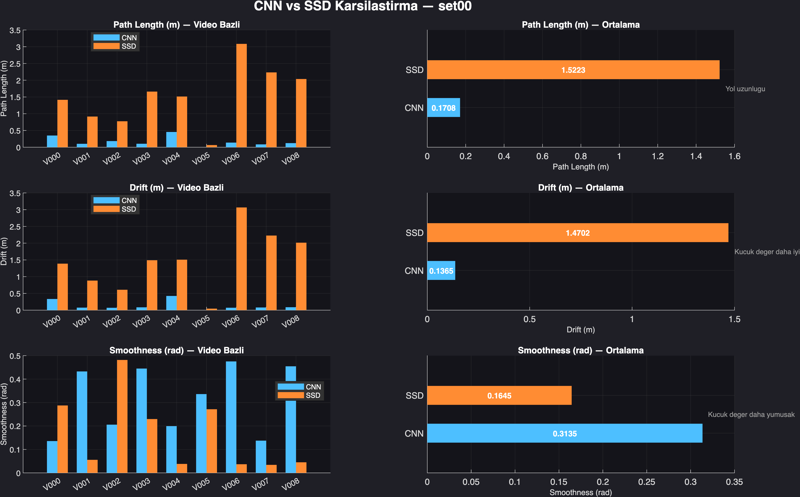
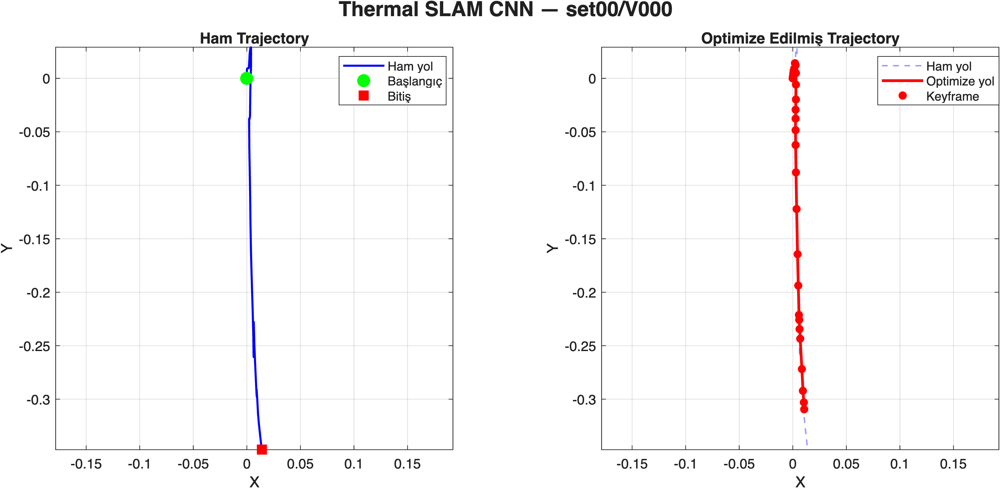
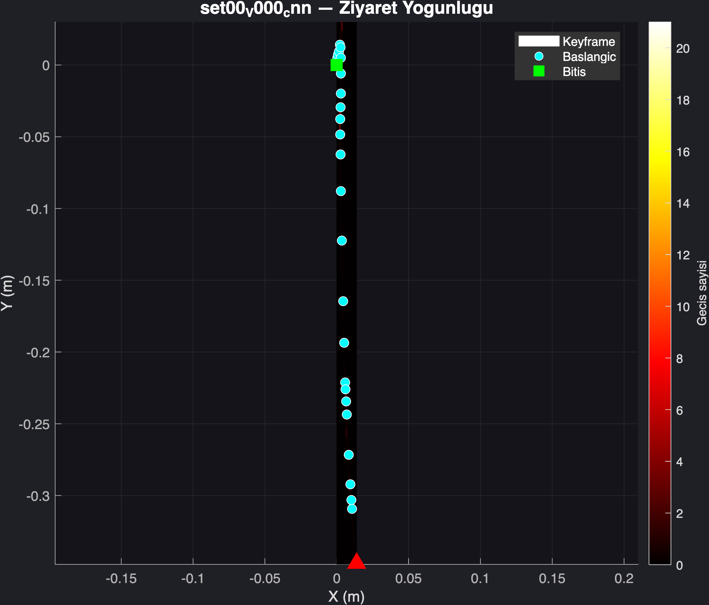
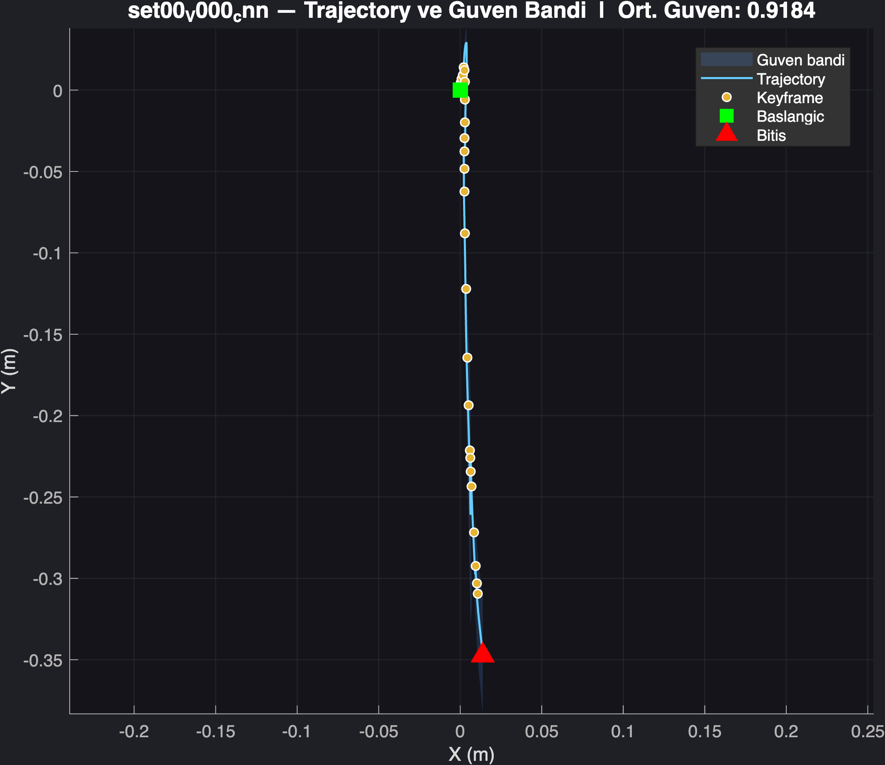
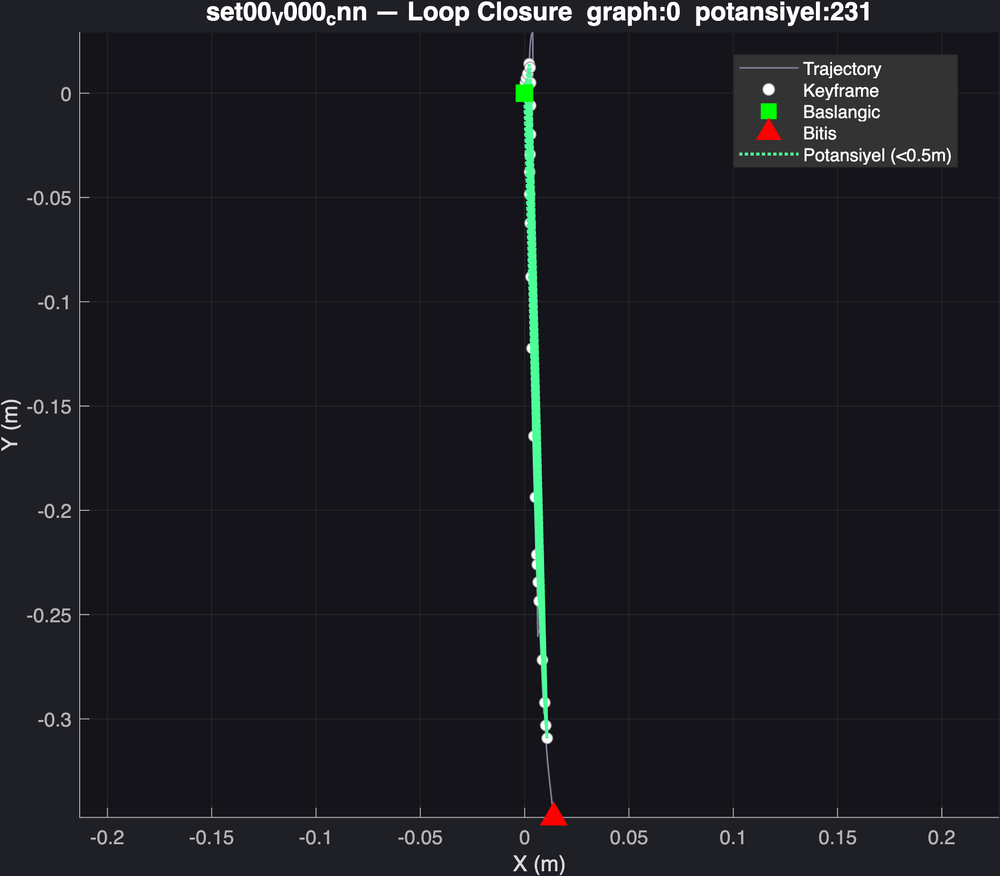

# Deep Learning Based Graph Thermal SLAM System

Bu proje, termal görüntüler kullanılarak geliştirilen CNN tabanlı ve grafik optimizasyonu destekli bir SLAM (Simultaneous Localization and Mapping) sistemidir.

Sistem MATLAB ortamında geliştirilmiş olup, KAIST Multispectral Pedestrian Dataset üzerinde çalışmaktadır.

Projede:

- CNN tabanlı görsel odometri
- SSD tabanlı klasik hareket tahmini
- Pose Graph yapısı
- Loop Closure tespiti
- Graph Optimization
- Trajectory analizi
- ATE / RTE metrikleri
- Gelişmiş görselleştirme sistemleri

kullanılmıştır.

---

# Proje Amacı

Bu projenin amacı, termal görüntüler üzerinden çalışan bir SLAM sistemi geliştirerek:

- hareket bilgisini çıkarmak,
- drift hatasını azaltmak,
- loop closure ile tekrar ziyaret edilen bölgeleri tespit etmek,
- CNN tabanlı yöntemler ile klasik SSD yöntemlerini karşılaştırmaktır.

---

# Sistem Pipeline'ı

```text
LWIR Frame
   ↓
Preprocessing
   ↓
Feature Extraction (CNN / SSD)
   ↓
Odometry Estimation
   ↓
Pose Estimation
   ↓
Pose Graph Construction
   ↓
Loop Closure Detection
   ↓
Graph Optimization
   ↓
Trajectory Visualization & Metrics
```

---

# Kullanılan Teknolojiler

| Teknoloji | Açıklama |
|---|---|
| MATLAB R2025b | Ana geliştirme ortamı |
| Deep Learning Toolbox | CNN işlemleri |
| ResNet-18 | CNN feature extraction |
| Pose Graph Optimization | Trajectory düzeltme |
| KAIST Dataset | Termal veri seti |
| CNN Feature Extraction | Derin öğrenme tabanlı özellik çıkarımı |
| SSD | Klasik frame matching yöntemi |

---

# Veri Seti

Projede aşağıdaki veri seti kullanılmıştır:

## KAIST Multispectral Pedestrian Dataset

Kullanılan görüntüler:

- LWIR (Long Wave Infrared)
- Sadece termal görüntüler kullanılmıştır
- Görüntü boyutu: `512x640`
- Frame formatı: `I00000.jpg`

Dataset yapısı:

```text
data/
├── set00/
├── set01/
├── set02/
├── set03/
├── set04/
└── set05/
```

---

# Proje Klasör Yapısı

```text
thermal-slam-project/
│
├── data/
├── results/
├── results_cnn/
├── results_ssd/
├── results_final/
│
├── src/
│   │
│   ├── preprocessing/
│   ├── odometry/
│   ├── pose_graph/
│   ├── loop_closure/
│   ├── visualization/
│   ├── training/
│   └── utils/
│
├── main_cnn.m
├── main_ssd.m
├── compare_cnn_ssd.m
├── evaluate_metrics.m
├── run_all_advanced.m
└── README.md
```

---

# Modül Açıklamaları

| Modül | Görevi |
|---|---|
| preprocessing | Termal görüntüyü normalize eder |
| odometry | Frame'ler arası hareket tahmini yapar |
| pose_graph | Robot pozisyonlarını graph yapısında tutar |
| loop_closure | Daha önce ziyaret edilen bölgeleri bulur |
| visualization | Grafik ve görsel üretir |
| training | CNN eğitimi ve fine-tuning işlemleri |
| utils | Yardımcı fonksiyonlar |

---

# Ana MATLAB Dosyaları

| Dosya | Açıklama |
|---|---|
| main_cnn.m | CNN tabanlı SLAM sistemi |
| main_ssd.m | SSD tabanlı SLAM sistemi |
| estimateShiftCNN.m | CNN ile displacement hesabı |
| estimateShiftSSD.m | SSD ile displacement hesabı |
| PoseGraph.m | Pose Graph veri yapısı |
| GraphOptimizer.m | Graph optimizasyonu |
| loop_detector.m | Loop closure tespiti |
| plot_advanced.m | Gelişmiş analiz görselleri |
| compare_cnn_ssd.m | CNN ve SSD karşılaştırması |

---

# Sistem Çıktıları

| Çıktı | Açıklama |
|---|---|
| trajectory | Robot hareket yolu |
| heatmap | En sık ziyaret edilen bölgeler |
| confidence | Hareket güven skoru |
| loop_closure | Tespit edilen loop bağlantıları |
| metrics | ATE / RTE sonuçları |
| compare | CNN vs SSD karşılaştırması |

---

# CNN vs SSD Karşılaştırması

<p align="center">
  
</p>

Bu karşılaştırma görseli, CNN tabanlı ve SSD tabanlı odometri yöntemlerinin performans farklarını göstermektedir.

---

# Trajectory Görselleştirmesi

<p align="center">
  
</p>

Bu görsel, CNN tabanlı termal SLAM sistemi tarafından oluşturulan trajectory sonucunu göstermektedir.

---

# Heatmap Görselleştirmesi

<p align="center">
  
</p>

Heatmap görselleştirmesi, sistemin en yoğun geçtiği bölgeleri göstermektedir.

---

# Confidence Görselleştirmesi

<p align="center">
  
</p>

Bu görsel trajectory güven seviyesini ve hareket kararlılığını göstermektedir.

---

# Loop Closure Görselleştirmesi

<p align="center">
  
</p>

Loop closure sistemi, daha önce ziyaret edilen bölgeleri tespit ederek trajectory drift hatasını azaltmaktadır.

---

# Projeyi Çalıştırma

## CNN Tabanlı SLAM

```matlab
addpath(genpath('src'))
main_cnn
```

---

## SSD Tabanlı SLAM

```matlab
addpath(genpath('src'))
main_ssd
```

---

## Gelişmiş Görselleri Üretme

```matlab
run_all_advanced('cnn')
run_all_advanced('ssd')
```

---

## CNN ve SSD Karşılaştırması

```matlab
compare_cnn_ssd
```

---

# Sonuçlar

Yapılan deneyler sonucunda:

- CNN tabanlı odometri yönteminin daha kararlı trajectory ürettiği,
- Pose Graph optimizasyonunun drift hatasını azalttığı,
- Loop Closure mekanizmasının trajectory tutarlılığını artırdığı,
- SSD yönteminin klasik fakat daha gürültülü sonuçlar verdiği

gözlemlenmiştir.

---
