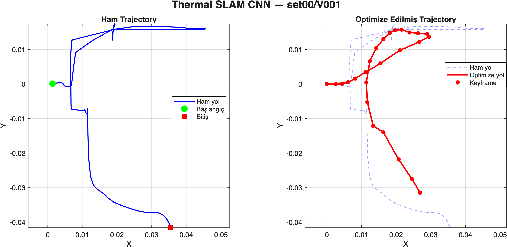
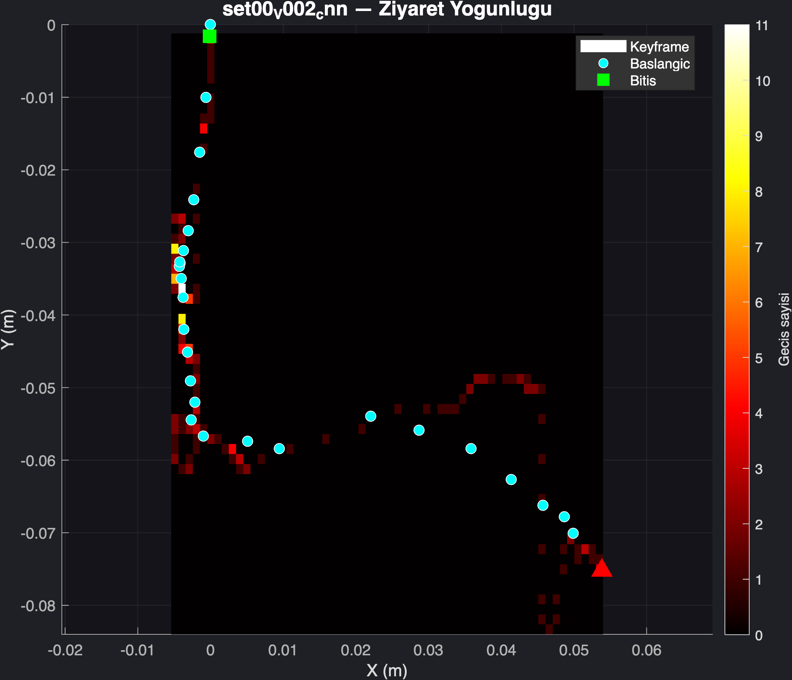
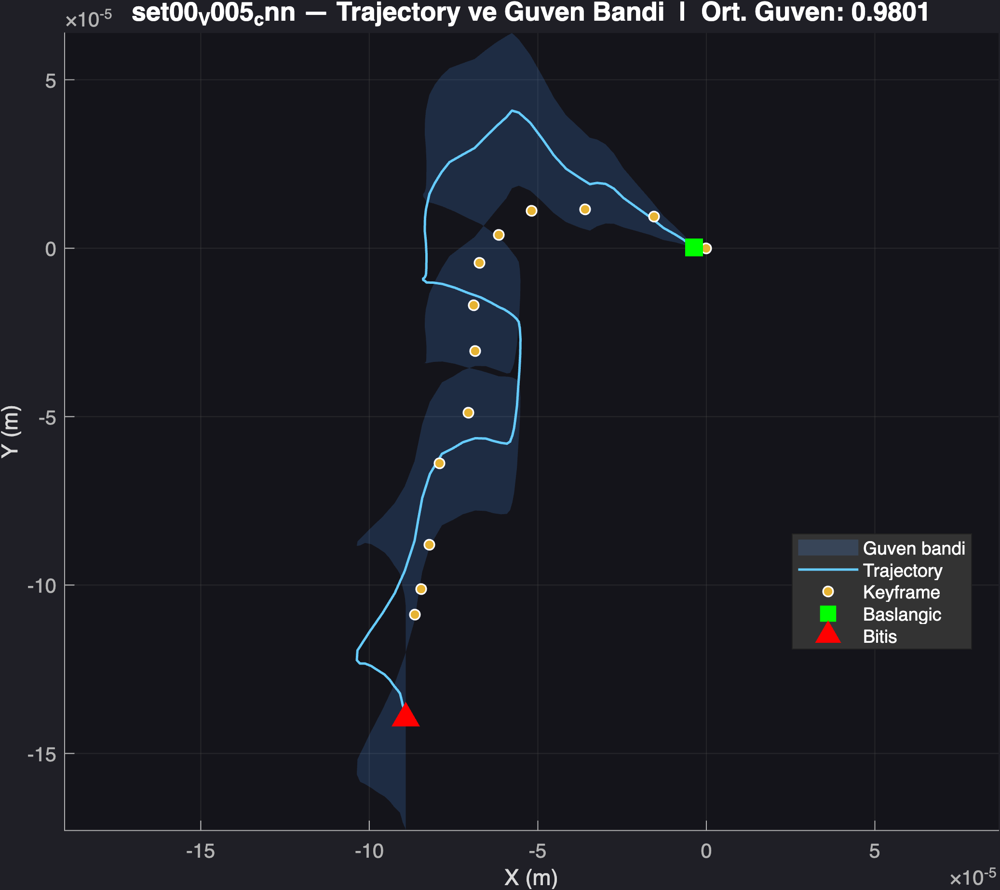
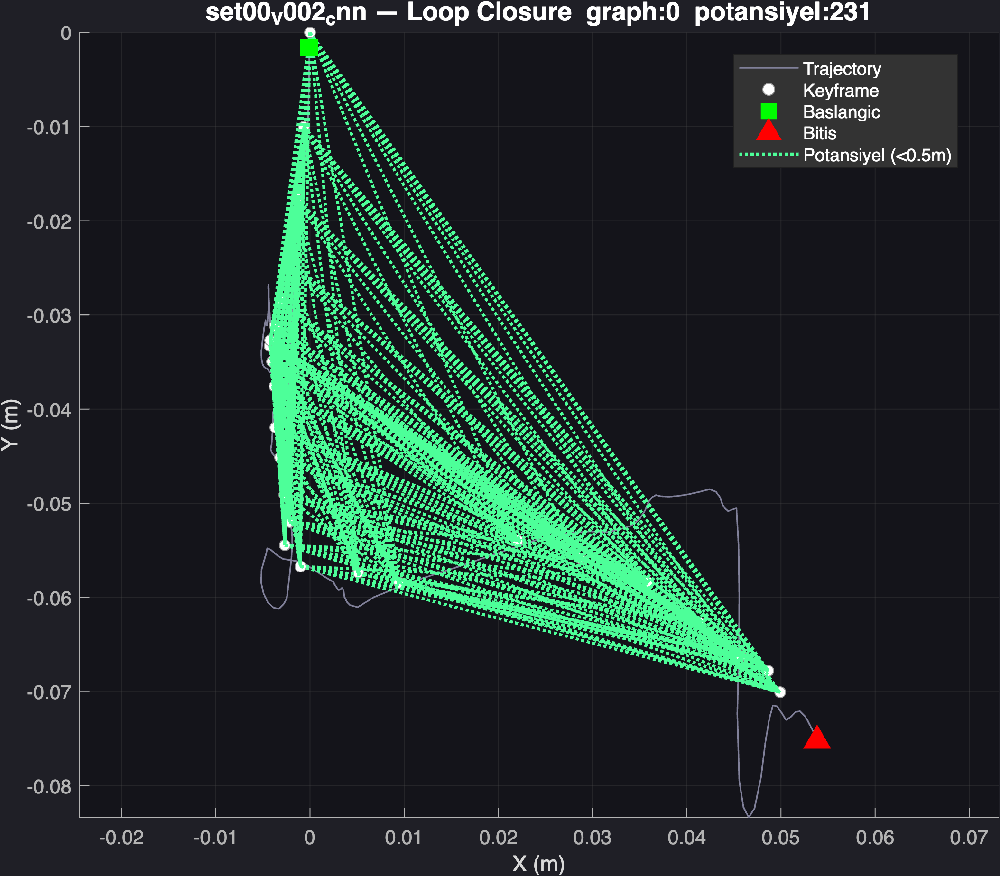

# Deep Learning Based Graph Thermal SLAM System

Bu proje, termal görüntüler kullanılarak geliştirilen CNN tabanlı ve grafik optimizasyonu destekli bir SLAM (Simultaneous Localization and Mapping) sistemidir.

Sistem MATLAB ortamında geliştirilmiş olup, KAIST Multispectral Pedestrian Dataset üzerinde çalışmaktadır.

Projede:

- CNN tabanlı görsel odometri
- SSD tabanlı klasik hareket tahmini
- Pose Graph yapısı
- Loop Closure tespiti
- Graph Optimization
- Trajectory analizi
- Ground truth olmadığında proxy trajectory metrikleri
- Gelişmiş görselleştirme sistemleri

kullanılmıştır.

---

# Proje Amacı

Bu projenin amacı, termal görüntüler üzerinden çalışan bir SLAM sistemi geliştirerek:

- hareket bilgisini çıkarmak,
- drift hatasını azaltmak,
- loop closure ile tekrar ziyaret edilen bölgeleri tespit etmek,
- CNN tabanlı yöntemler ile klasik SSD yöntemlerini karşılaştırmaktır.

---

# Sistem Pipeline'ı

```text
LWIR Frame
   ↓
Preprocessing
   ↓
Feature Extraction (CNN / SSD)
   ↓
Odometry Estimation
   ↓
Pose Estimation
   ↓
Pose Graph Construction
   ↓
Loop Closure Detection
   ↓
Graph Optimization
   ↓
Trajectory Visualization & Metrics
```

---

# Kullanılan Teknolojiler

| Teknoloji | Açıklama |
|---|---|
| MATLAB R2025b | Ana geliştirme ortamı |
| Deep Learning Toolbox | CNN işlemleri |
| ResNet-18 | CNN feature extraction |
| Pose Graph Optimization | Trajectory düzeltme |
| KAIST Dataset | Termal veri seti |
| CNN Feature Extraction | Derin öğrenme tabanlı özellik çıkarımı |
| SSD | Klasik frame matching yöntemi |

---

# Veri Seti

Projede aşağıdaki veri seti kullanılmıştır:

## KAIST Multispectral Pedestrian Dataset

Kullanılan görüntüler:

- LWIR (Long Wave Infrared)
- Sadece termal görüntüler kullanılmıştır
- Görüntü boyutu: `512x640`
- Frame formatı: `I00000.jpg`

Dataset yapısı:

```text
data/
├── set00/
├── set01/
├── set02/
├── set03/
├── set04/
└── set05/
```

---

# Proje Klasör Yapısı

```text
thermal-slam-project/
│
├── data/
├── results/
├── results_cnn/
├── results_ssd/
├── results_final/
│
├── src/
│   │
│   ├── preprocessing/
│   ├── odometry/
│   ├── pose_graph/
│   ├── loop_closure/
│   ├── visualization/
│   ├── training/
│   └── utils/
│
├── main_cnn.m
├── main_ssd.m
├── compare_cnn_ssd.m
├── evaluate_metrics.m
├── run_all_advanced.m
└── README.md
```

---

# Modül Açıklamaları

| Modül | Görevi |
|---|---|
| preprocessing | Termal görüntüyü normalize eder |
| odometry | Frame'ler arası hareket tahmini yapar |
| pose_graph | Robot pozisyonlarını graph yapısında tutar |
| loop_closure | Daha önce ziyaret edilen bölgeleri bulur |
| visualization | Grafik ve görsel üretir |
| training | CNN eğitimi ve fine-tuning işlemleri |
| utils | Yardımcı fonksiyonlar |

---

# Ana MATLAB Dosyaları

| Dosya | Açıklama |
|---|---|
| main_cnn.m | CNN tabanlı SLAM sistemi |
| main_ssd.m | SSD tabanlı SLAM sistemi |
| estimateShiftCNN.m | CNN ile displacement hesabı |
| estimateShiftSSD.m | SSD ile displacement hesabı |
| PoseGraph.m | Pose Graph veri yapısı |
| GraphOptimizer.m | Graph optimizasyonu |
| loop_detector.m | Loop closure tespiti |
| plot_advanced.m | Gelişmiş analiz görselleri |
| compare_cnn_ssd.m | CNN ve SSD karşılaştırması |

---

# Sistem Çıktıları

| Çıktı | Açıklama |
|---|---|
| trajectory | Robot hareket yolu |
| heatmap | En sık ziyaret edilen bölgeler |
| confidence | Hareket güven skoru |
| loop_closure | Tespit edilen loop bağlantıları |
| metrics | Ground truth olmadığında proxy metrik sonuçları |
| compare | CNN vs SSD karşılaştırması |
---

# Final DNN Graph Thermal SLAM Pipeline

Bu projede final başlığı desteklemek için CNN/SSD karşılaştırmasına ek olarak DNN tabanlı bir graph thermal SLAM hattı da oluşturulmuştur.

Final DNN hattı şu adımlardan oluşur:

```text
Termal frame çifti
   ↓
Siamese ResNet feature extraction
   ↓
DNN odometri regresyonu: dx, dy, dtheta
   ↓
Pose graph node/edge kurulumu
   ↓
CNN feature tabanlı loop closure detection
   ↓
Loop edge ekleme
   ↓
Graph optimization
   ↓
Trajectory, loop closure ve proxy metrikler
```

Bu hatta CNN yalnızca görselleştirme amacıyla kullanılmamaktadır. İki ardışık termal frame'den çıkarılan ResNet feature vektörleri birleştirilerek DNN odometri regresyon modeline verilir ve model göreli hareket tahmini üretir. Bu tahminler pose graph yapısına odometry edge olarak eklenir.

Final DNN çıktıları:

```text
results/siamese_odometry_data.mat
results/siamese_odometry_model.mat
results/figures/siamese_odometry_validation.png

results_final/mat/dnn/*_dnn_traj.mat
results_final/mat/dnn/*_dnn_graph.mat
results_final/mat/dnn/*_dnn_conf.mat
results_final/mat/dnn/dnn_proxy_metrics.mat
results_final/mat/dnn/dnn_metrics.mat
results_final/mat/dnn/pseudo_label_quality.mat
results_final/mat/dnn/loop_feasibility.mat

results_final/figures/trajectory/*_dnn_trajectory.png
results_final/figures/advanced/dnn/
results_final/figures/metrics/dnn_proxy_metrics.png
results_final/figures/metrics/dnn_metrics.png
results_final/figures/metrics/pseudo_label_quality.png
results_final/figures/metrics/loop_feasibility.png
```

---

# CNN vs SSD Karşılaştırması

<p align="center">
  
</p>

Bu karşılaştırma görseli, CNN tabanlı ve SSD tabanlı odometri yöntemlerinin farklı metrikler üzerindeki performans farklarını göstermektedir.

Karşılaştırma içerisinde:

- Path Length
- Drift
- Smoothness

metrikleri video bazlı ve ortalama olarak analiz edilmiştir.

---

# Raw vs Optimized Trajectory

<p align="center">
  
</p>

Bu görsel, CNN tabanlı termal SLAM sistemi tarafından oluşturulan ham trajectory ile optimize edilmiş trajectory sonuçlarını göstermektedir.

Pose Graph Optimization işlemi sonrası trajectory yapısındaki drift etkisinin azaltıldığı gözlemlenmektedir.

---

# Heatmap Görselleştirmesi

<p align="center">
  
</p>

Heatmap görselleştirmesi, trajectory boyunca sistemin en yoğun geçtiği bölgeleri göstermektedir.

Yüksek yoğunluklu bölgeler, tekrar ziyaret edilen veya uzun süre boyunca takip edilen alanları temsil etmektedir.

---

# Confidence Görselleştirmesi

<p align="center">
  
</p>

Bu görsel trajectory güven seviyesini ve hareket kararlılığını göstermektedir.

Trajectory etrafındaki güven bandı, sistemin hareket tahminlerindeki güven seviyesini görselleştirmektedir.

---

# Loop Closure Görselleştirmesi

<p align="center">
  
</p>

Bu görsel, trajectory üzerindeki potansiyel loop closure bölgelerini göstermektedir.

Gerçek loop edge yapısı yerine proximity-based loop analizi kullanılmıştır. Belirli mesafe eşiklerinin altında kalan bölgeler potansiyel loop closure alanları olarak işaretlenmiştir.

---

# Projeyi Çalıştırma

## CNN Tabanlı SLAM

```matlab
addpath(genpath('src'))
main_cnn
```

---

## SSD Tabanlı SLAM

```matlab
addpath(genpath('src'))
main_ssd
```

---

## Gelişmiş Görselleri Üretme

```matlab
run_all_advanced('cnn')
run_all_advanced('ssd')
```

---

## CNN ve SSD Karşılaştırması

```matlab
compare_cnn_ssd
```

---

## Final DNN Graph Thermal SLAM

```matlab
addpath(genpath('src'))
generate_siamese_odometry_data
train_siamese_odometry
main_dnn_slam
evaluate_dnn_proxy_metrics
evaluate_dnn_metrics
evaluate_pseudo_label_quality
evaluate_loop_feasibility
```

---

# Sonuçlar

Yapılan deneyler sonucunda:

- CNN tabanlı odometri yönteminin termal görüntüler üzerinde güçlü feature extraction yeteneği sağladığı,
- Pose Graph Optimization işleminin trajectory drift hatasını azalttığı,
- Loop Closure analizlerinin trajectory tutarlılığını artırdığı,
- SSD yönteminin klasik ve hesaplama açısından daha hafif bir yaklaşım sunduğu,
- CNN, SSD ve DNN tabanlı yöntemlerin farklı senaryolarda farklı avantajlar gösterdiği,
- DNN tabanlı final hattın termal frame çiftlerinden göreli hareket tahmini üretip bu tahminleri pose graph optimizasyonuna dahil edebildiği

gözlemlenmiştir.

---
